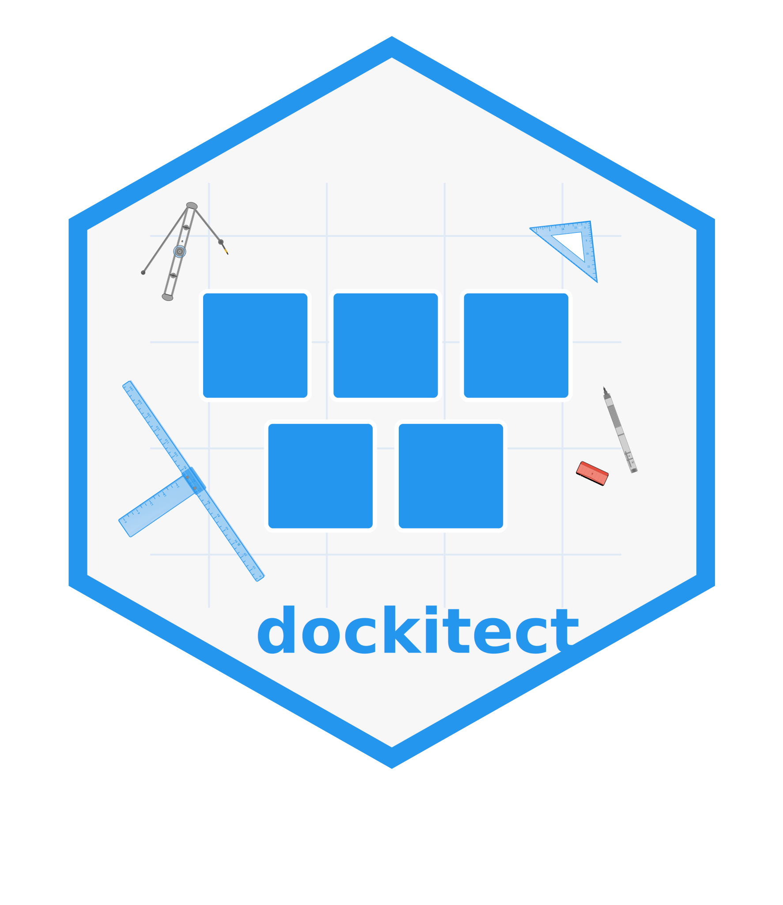

<!-- README.md is generated from README.Rmd. Please edit that file -->

```{r, include = FALSE}
knitr::opts_chunk$set(
  collapse = TRUE,
  comment = "#>",
  fig.path = "man/figures/README-",
  out.width = "100%"
)
```

# dockitect  

<!-- badges: start -->
[](https://github.com/coatless-rpkg/dockitect/actions/workflows/R-CMD-check.yaml)
<!-- badges: end -->

`dockitect` is an R package for programmatically creating, validating, and 
managing Dockerfiles using a pipe-friendly syntax. It bridges the gap between 
R development and containerization, enabling seamless Docker integration for 
data science workflows.

> [!IMPORTANT]
>
> This package is currently in the prototype/experimental stage. It is
> not yet available on CRAN and may have bugs or limitations.

## Installation

You can install the development version of `dockitect` from
[GitHub](https://github.com/coatless-rpkg/dockitect) with:

```{r}
#| label: setup
#| eval: false
# install.packages("remotes")
remotes::install_github("coatless-rpkg/dockitect")
```


## Design Philosophy

To make the API intuitive and discoverable, `dockitect` employs a naming
convention across all its functions. Understanding these prefixes will 
help you navigate the package and find the functions you need:

- `dockerfile()` - Create a new Dockerfile object
  - `dfi_*()` - **D**ockerfile **i**nstruction functions (e.g., `dfi_from()`, `dfi_run()`)
  - `dfm_*()` - **D**ockerfile **m**odification functions (e.g., `dfm_add_line()`, `dfm_group_similar()`)
- `dockerignore()` - Create a new Dockerignore object
  - `di_*()` - **D**ockerignore functions (e.g., `di_add()`, `di_remove()`)
- `dk_*()` - **D**oc**k**er configuration/template functions (e.g., `dk_from_session()`, `dk_template_shiny()`)

## Usage

The following examples demonstrate how to use `dockitect` for various 
containerization scenarios. Each example showcases different aspects of the 
package's functionality, from basic Dockerfile creation to more advanced use cases.

### Dockerfile Creation

Let's start with the fundamentals. Creating a Dockerfile typically involves 
specifying a base image, installing dependencies, copying files, and defining 
commands. With `dockitect`, this process becomes a series of intuitive pipe-chained functions. 

For example, let's create a Dockerfile for an R script:

```{r}
#| label: basic-dockerfile
#| eval: false
library(dockitect)

# Create a basic Dockerfile for an R script
dockerfile() |>
  dfi_from("rocker/r-ver:4.2.3") |>
  dfi_label(maintainer = "user@example.com") |>
  dfi_run("apt-get update && apt-get install -y libcurl4-openssl-dev") |>
  dfi_workdir("/app") |>
  dfi_copy("analysis.R", "/app/") |>
  dfi_cmd("Rscript analysis.R") |>
  write_dockerfile("Dockerfile")
```

### Use Templates

`dockitect` includes specialized templates for common R application types, 
saving you time and ensuring best practices are followed. These templates are 
fully customizable and provide a solid foundation for your projects.

#### Shiny Application

Creating a Docker container for a Shiny application requires specific 
configurations for ports, networking, and dependencies. The Shiny template
handles these details automatically. For example, we can create a Dockerfile
for a Shiny app with proper port configuration:

```{r}
#| label: shiny-template-demo
#| eval: false
# Create a Dockerfile for a Shiny app
dk_template_shiny(
  r_version = "4.2.3",       # Specify R version
  port = 3838,               # Expose Shiny port
  app_dir = "app/"           # Location of app files
) |>
  dfi_env(SHINY_HOST = "0.0.0.0") |>  # Configure Shiny to listen on all interfaces
  write_dockerfile()
```

### Custom Templates

While `dockitect` includes templates for common scenarios, your organization
might have specific containerization patterns. The template system is
extensible, allowing you to create, register, and reuse your own templates
throughout your projects:

```{r}
#| label: custom-template-demo
#| eval: false
# Create a custom template function
my_template <- function(my_param = "default") {
  dockerfile() |>
    dfi_from("rocker/r-ver:4.2.3") |>
    dfi_run(paste0("echo ", my_param))
}

# Register the template
dk_register_template("my_template", my_template)

# Use the template
dk_template_custom("my_template", my_param = "hello") |>
  write_dockerfile()
```


### Modify Existing Dockerfiles

Sometimes you need to modify existing Dockerfiles rather than creating them
from scratch. `dockitect` provides specialized functions for reading, modifying,
and writing Dockerfiles, allowing for precise changes without manual text editing:

```{r}
#| label: existing-dockerfile-modifications
#| eval: false
# Read an existing Dockerfile
df <- read_dockerfile("path/to/Dockerfile")

# Modify it
df |>
  dfm_add_line("RUN echo 'Hello World'", after = 3) |> # Add a line after line 3
  dfm_remove_line(5) |>                                # Remove line 5
  dfm_group_similar() |>                               # Group similar commands (e.g., RUN)
  write_dockerfile("Dockerfile.new")                   # Write to a new file
```

### Create and Manage .dockerignore

Docker builds can be slowed down by unnecessarily including large or irrelevant
files in the build context. A properly configured `.dockerignore` file helps
keep your builds fast and your images small. `dockitect` makes it easy to 
create and maintain a `.dockerignore` file through `dockerignore()`.

```{r}
#| label: create-dockerignore
#| eval: false
# Create a .dockerignore file with common patterns
dockerignore() |>
  di_add_common(include_git = TRUE, include_r = TRUE) |>  # Add common patterns for Git and R
  di_add("*.log") |>                                      # Add custom patterns
  di_add("output/") |>
  write_dockerignore()
```

## Related Packages

`dockitect` is part of a broader ecosystem of tools for containerization and
environment management in R. Depending on your specific needs, you might want
to explore these complementary packages:

- [`containerit`][containerit-pkg]: An alternative approach to generating 
  Dockerfiles, with a focus on reproducible research workflows
- `dockerfiler`[containerit-pkg]: Another R package for Dockerfile generation 
  that uses a different syntax and approach
- [`renv`][renv-pkg]: For R package dependency management, which pairs well 
  with `dockitect` for fully reproducible environments

## Citation

If you use `dockitect` in your research or project, please consider citing it:

```r
citation("dockitect")
```

## License

AGPL (>=3)

[containerit-pkg]: https://github.com/o2r-project/containerit
[dockerfiler-pkg]: https://github.com/ThinkR-open/dockerfiler
[renv-pkg]: https://github.com/rstudio/renv/
